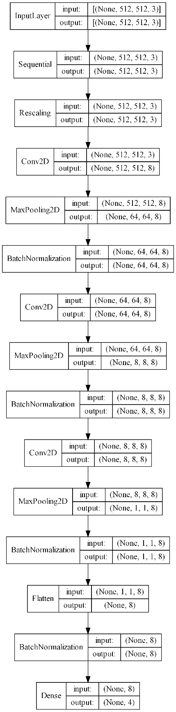

# Towards-Classification-of-Miniature-Images
Repository for supporting files and outcomes for my paper entitled
___[Towards Accurate Classification of Miniature Images](https://www.amerikakongresi.org/_files/ugd/797a84_42d94c1e33d641d4a0615d9494ee582c.pdf)___
presented in 
___[Latin America 5th International Conference on Scientific Researches](https://www.amerikakongresi.org/)___, March 17-19, Medellin, Columbia, 2023.


Please cite this proceeding as follows:

*Temiz, H. (2023). Towards Accurate Classification of Miniature Images. Latin America 5th International Conference on 
Scientific Researches,Medellin, pp. 181-187.*


Please feel free to contact me at [htemiz@artvin.edu.tr](mailto:htemiz@artvin.edu.tr) for further information and comments.

### Overview
Miniatures are small images drawn on manuscripts to visually describe the subject of the manuscripts. 
Miniature paintings are made to provide a better understanding of what is told in the texts or to strengthen 
the narration. Ottomans used the miniatures between 14th and 18th centuries.

They depict portraits, lives of sultans, festivals, historical events, lifestyle, nature and city views, 
literary works, religious subjects, traditions and customs, women and men, and creatures such as animals and plants.
[cnn.py](model%2Fcnn.py)
In this work aimed to teach the computer to identify the artists of the miniatures from given images. To accomplish this, 
a convolutional neural network (CNN) is trained with some miniature images of four different artists. 

### Dataset
Dataset consists of 380 images belonging the following four artists: 
Levni, Matrakçı Nasuh, Rumuzi and Seyyid Lokman. The images were downloaded from [https://www.turkishculture.org](https://www.turkishculture.org)

|||||
|Craftsman|Training|Test|Totoal|
|Levni|85|9|94|
|Matrakçı Nasuh|87|9|96|
|Rumuzi|84|9|93|
|Seyyid Lokman|88|9|97|
|Total|344|36|380|


### Algorithm
Entire experiment is done with Keras. The architecture of the algorithm is as follows:



#### Code of the Model
The partial code of the CNN model structure is given below. This code is only a part of the class `My_Model`, which is 
defined in `abstract_model.py. Code for evaluation metrics is in `metrics.py` file. Entire work is done with the class.

Some codes refer to members and methods in the class `My_Model`.

```python

metrics = self.metrics if mode=='train' else self.test_metrics
main_input = Input(shape=self.input_shape, name='main_input')
x = self.data_augmentation(main_input)
x = self.fn_normalization(x)
feature_extraction = Conv2D(self.n_filters, (3, 3), kernel_initializer='glorot_uniform', activation=self.activation, padding='same')(x)
if self.max_pooling:
    feature_extraction = MaxPooling2D(pool_size, padding='valid')(feature_extraction)# feature_extraction = Conv2D(self.n_filters, (3, 3), kernel_initializer='glorot_uniform', activation=self.activation, padding='same')(feature_extraction)

if self.normalize_batch:
    feature_extraction = BatchNormalization()(feature_extraction)

feature_extraction = Conv2D(self.n_filters, (3, 3), kernel_initializer='glorot_uniform', activation=self.activation, padding='same')(feature_extraction)

if self.max_pooling:
    feature_extraction = MaxPooling2D(pool_size, padding='valid')(feature_extraction)

    if self.normalize_batch:
        feature_extraction = BatchNormalization()(feature_extraction)

feature_extraction = Conv2D(self.n_filters, (3, 3), kernel_initializer='glorot_uniform', activation=self.activation, padding='same')(feature_extraction)

if self.max_pooling:
    feature_extraction = MaxPooling2D(pool_size, padding='valid')(feature_extraction)

    if self.normalize_batch:
        feature_extraction = BatchNormalization()(feature_extraction)

x = Flatten()(feature_extraction)

if self.normalize_batch:
    x = BatchNormalization()(x)
# x = keras.layers.Dense(16, activation='relu')(x)
output = Dense(4, activation='softmax')(x)

model = Model(main_input, outputs=output, trainable=False)

model.compile(
    optimizer=self.optimizer,
    loss=self.loss, # CategoricalCrossentropy(from_logits=True), #
    metrics=metrics,
)

model.summary()

return model
        
```

#### How to Run
In the experiment many alternatives of hyper-parameters were tried. You can start the experiment with `run.py`. To run,  
```shell
python run.py
```


### Training


