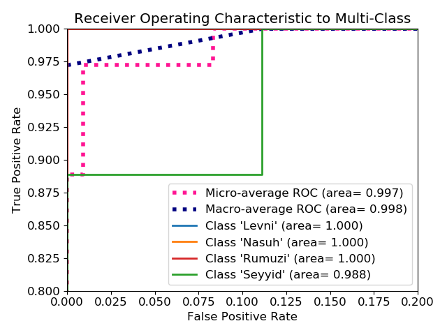

# Towards-Classification-of-Miniature-Images
Repository for supporting files and outcomes for my paper entitled
___[Towards Accurate Classification of Miniature Images](https://www.amerikakongresi.org/_files/ugd/797a84_42d94c1e33d641d4a0615d9494ee582c.pdf)___
presented in 
___[Latin America 5th International Conference on Scientific Researches](https://www.amerikakongresi.org/)___, March 17-19, Medellin, Columbia, 2023.


Please cite this proceeding as follows:

*Temiz, H. (2023). Towards Accurate Classification of Miniature Images. Latin America 5th International Conference on 
Scientific Researches,Medellin, pp. 181-187.*


Please feel free to contact me at [htemiz@artvin.edu.tr](mailto:htemiz@artvin.edu.tr) for further information and comments.

### Overview
Miniatures are small images drawn on manuscripts to visually describe the subject of the manuscripts. 
Miniature paintings are made to provide a better understanding of what is told in the texts or to strengthen 
the narration. Ottomans used the miniatures between 14th and 18th centuries.

They depict portraits, lives of sultans, festivals, historical events, lifestyle, nature and city views, 
literary works, religious subjects, traditions and customs, women and men, and creatures such as animals and plants.
[cnn.py](model%2Fcnn.py)
In this work aimed to teach the computer to identify the artists of the miniatures from given images. To accomplish this, 
a convolutional neural network (CNN) is trained with some miniature images of four different artists. 

### Dataset
Dataset consists of 380 images belonging the following four artists: 
Levni, Matrakçı Nasuh, Rumuzi and Seyyid Lokman. The images were downloaded from [https://www.turkishculture.org](https://www.turkishculture.org)

Here is the details of the dataset:

|Craftsman|Training|Test|Total|
|--|--|--|--|
|Levni|85|9|94|
|Matrakçı Nasuh|87|9|96|
|Rumuzi|84|9|93|
|Seyyid Lokman|88|9|97|
|**Total**|**344**|**36**|**380**|

A couple of sample miniature images of each craftsmen:

<table>
<tr style="text-align: center;"></tr>
    <td colspan="2" style="text-align: center;">Levni</td>
    <td colspan="2" style="text-align: center;">Matrakçı Nasuh</td>
    <td colspan="2" style="text-align: center;">Rumuzi</td>
    <td colspan="2" style="text-align: center;">Seyyid Lokman</td>
<tr></tr>
    <td></td>
    <td></td>
    <td></td>
    <td></td>
    <td></td>
    <td></td>
    <td></td>
    <td></td>
<tr></tr>
</table>

The data augmented by the following operations while training the algorithm:

- RandomFlip(‘horizontal’)
- RandomRotation(0.10)
- RandomRotation(0.15)
- RandomRotation(0.25)


### Algorithm
Entire experiment is done with Keras. The architecture of the algorithm is as follows:


#### Code of the Model
The partial code of the CNN model structure is given below. This code is a member of the class `My_Model`, which is 
defined in `abstract_model.py`. Entire work is done through this class.

Some codes refer to members and methods in the class. Please refer to the class definition for actual values/setting of the 
variables.  You can simplify the code and adapt it to your own implementation by replacing the codes referring to the 
member methods or variables of the class with their active values. E.g., rather than referring to class's member

```python
metrics = self.metrics 
```

write


```python
metrics=['categorical_accuracy']
```

Full code of the method creating the algorithm:

```python

def __get_model__(self, mode='train' ):
    
    metrics = self.metrics if mode=='train' else self.test_metrics
    main_input = Input(shape=self.input_shape, name='main_input')
    x = self.data_augmentation(main_input) # augment dataset
    x = self.fn_normalization(x) # apply normalization function
    feature_extraction = Conv2D(self.n_filters, (3, 3), kernel_initializer='glorot_uniform', activation=self.activation, padding='same')(x)
    if self.max_pooling:
        feature_extraction = MaxPooling2D(pool_size, padding='valid')(feature_extraction)# feature_extraction = Conv2D(self.n_filters, (3, 3), kernel_initializer='glorot_uniform', activation=self.activation, padding='same')(feature_extraction)
    
    if self.normalize_batch:
        feature_extraction = BatchNormalization()(feature_extraction)
    
    feature_extraction = Conv2D(self.n_filters, (3, 3), kernel_initializer='glorot_uniform', activation=self.activation, padding='same')(feature_extraction)
    
    if self.max_pooling:
        feature_extraction = MaxPooling2D(pool_size, padding='valid')(feature_extraction)
    
        if self.normalize_batch:
            feature_extraction = BatchNormalization()(feature_extraction)
    
    feature_extraction = Conv2D(self.n_filters, (3, 3), kernel_initializer='glorot_uniform', activation=self.activation, padding='same')(feature_extraction)
    
    if self.max_pooling:
        feature_extraction = MaxPooling2D(pool_size, padding='valid')(feature_extraction)
    
        if self.normalize_batch:
            feature_extraction = BatchNormalization()(feature_extraction)
    
    x = Flatten()(feature_extraction)
    
    if self.normalize_batch:
        x = BatchNormalization()(x)
    # x = keras.layers.Dense(16, activation='relu')(x)
    output = Dense(4, activation='softmax')(x)
    
    model = Model(main_input, outputs=output, trainable=False)
    
    model.compile(
        optimizer=self.optimizer,
        loss=self.loss, # CategoricalCrossentropy(from_logits=True), #
        metrics=metrics,
    )
    
    model.summary()
    
    return model
        
```

#### How to Run
In the experiment many alternatives of hyper-parameters were tried. You can start the experiment with `run.py`. To run,  
```shell
python run.py
```


### Training
The following hyper-parameter values were used in training the algorithm:

- Epoch = 1000
- Learning rate = 1E-3
- Learning rate patience = 100 epochs
- Learning rate factor = 1/2
- Early stopping patience = 500 epochs
- Batch size = 16

The visuallization of the training performance of the algorithm:


### Results

|Categorical Accuracy|Precision|Recall|AUC|
|--|--|--|--|
|0.9722|0.9706|0.9167|0.9968|

&nbsp;

**Confusion Matrix**


#### Receiver Operating Characteristic (ROC) Curve: 



